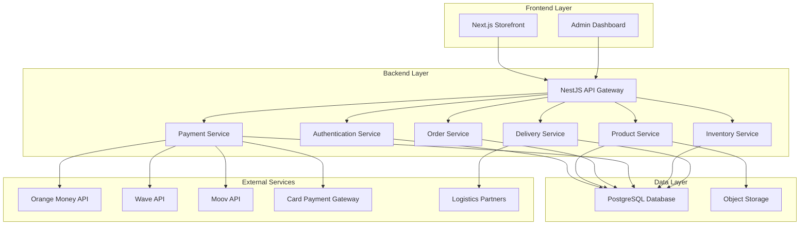

# Design Document: West Africa E-commerce Platform

## Overview

The West Africa e-commerce platform is a full-stack web application built with NestJS backend and Next.js frontend, designed specifically for the West African market. The system supports multi-country operations (Mali, Côte d'Ivoire, Burkina Faso) with localized payment methods, delivery options, and FCFA pricing.

The architecture follows a modular, scalable approach with clear separation between the customer-facing storefront, admin dashboard, and backend services. The platform is optimized for mobile-first usage and low-bandwidth conditions common in the target markets.

## Architecture

### High-Level Architecture



### Technology Stack

**Backend:**
- **Framework:** NestJS with TypeScript
- **Database:** PostgreSQL with TypeORM
- **Authentication:** JWT with role-based access control
- **File Storage:** Object storage for product images
- **Caching:** Redis for session management and performance

**Frontend:**
- **Framework:** Next.js 14+ with TypeScript
- **Styling:** Tailwind CSS for mobile-first responsive design
- **State Management:** Redux Rtk toolkquit and Redux RTkQueries fro centralized api calls.
- **Forms:** React Hook Form with validation
- **UI Components:** Custom component library optimized for West African UX

**Infrastructure:**
- **Deployment:** Docker containers
- **Monitoring:** Application performance monitoring
- **Security:** HTTPS everywhere, input validation, SQL injection protection

## Components and Interfaces

### Core Backend Modules

#### 1. Authentication Module
```typescript
interface AuthService {
  login(credentials: LoginDto): Promise<AuthResult>
  register(userData: RegisterDto): Promise<User>
  validateToken(token: string): Promise<User>
  refreshToken(refreshToken: string): Promise<AuthResult>
}

interface User {
  id: string
  email?: string
  phone: string
  fullName: string
  role: UserRole
  country: CountryCode
}

enum UserRole {
  ADMIN = 'admin',
  STAFF = 'staff',
  CUSTOMER = 'customer'
}
```

#### 2. Product Module
```typescript
interface ProductService {
  createProduct(productData: CreateProductDto): Promise<Product>
  updateProduct(id: string, updates: UpdateProductDto): Promise<Product>
  getProducts(filters: ProductFilters): Promise<PaginatedProducts>
  getProductById(id: string): Promise<Product>
  deleteProduct(id: string): Promise<void>
}

interface Product {
  id: string
  name: string
  slug: string
  description: string
  category: Category
  segment: ProductSegment
  brand: string
  isRefurbished: boolean
  refurbishedGrade?: RefurbishedGrade
  warrantyMonths: number
  specifications: ProductSpec[]
  images: ProductImage[]
  prices: CountryPrice[]
  createdAt: Date
  updatedAt: Date
}

enum ProductSegment {
  PREMIUM = 'premium',
  MID_RANGE = 'mid_range',
  REFURBISHED = 'refurbished'
}

enum RefurbishedGrade {
  A = 'A',
  B = 'B',
  C = 'C'
}
```

#### 3. Order Module
```typescript
interface OrderService {
  createOrder(orderData: CreateOrderDto): Promise<Order>
  updateOrderStatus(orderId: string, status: OrderStatus): Promise<Order>
  getOrderById(orderId: string): Promise<Order>
  getOrdersByUser(userId: string): Promise<Order[]>
  getOrdersByCountry(country: CountryCode): Promise<Order[]>
}

interface Order {
  id: string
  userId?: string
  country: CountryCode
  status: OrderStatus
  items: OrderItem[]
  totalAmount: number
  deliveryFee: number
  deliveryAddress: Address
  paymentMethod: PaymentMethod
  createdAt: Date
  updatedAt: Date
}

enum OrderStatus {
  PENDING = 'pending',
  PAID = 'paid',
  SHIPPED = 'shipped',
  DELIVERED = 'delivered',
  CANCELLED = 'cancelled'
}
```

#### 4. Payment Module
```typescript
interface PaymentService {
  initiatePayment(paymentData: InitiatePaymentDto): Promise<PaymentResult>
  verifyPayment(transactionRef: string): Promise<PaymentStatus>
  processRefund(paymentId: string, amount: number): Promise<RefundResult>
}

interface PaymentProvider {
  processPayment(request: PaymentRequest): Promise<PaymentResponse>
  verifyTransaction(transactionId: string): Promise<TransactionStatus>
}

enum PaymentMethod {
  ORANGE_MONEY = 'orange_money',
  WAVE = 'wave',
  MOOV = 'moov',
  CARD = 'card'
}
```

#### 5. Inventory Module
```typescript
interface InventoryService {
  updateStock(productId: string, quantity: number): Promise<InventoryItem>
  checkAvailability(productId: string, quantity: number): Promise<boolean>
  getLowStockItems(threshold: number): Promise<InventoryItem[]>
  reserveStock(productId: string, quantity: number): Promise<StockReservation>
}

interface InventoryItem {
  id: string
  productId: string
  quantity: number
  warehouseLocation: string
  supplierId: string
  lastUpdated: Date
}
```

### Frontend Components

#### 1. Country Selection Component
```typescript
interface CountrySelector {
  selectedCountry: CountryCode
  onCountryChange: (country: CountryCode) => void
  availableCountries: Country[]
}

interface Country {
  code: CountryCode
  name: string
  currency: string
  flag: string
}
```

#### 2. Product Catalog Components
```typescript
interface ProductGrid {
  products: Product[]
  segment: ProductSegment
  onProductClick: (product: Product) => void
  loading: boolean
}

interface ProductCard {
  product: Product
  showRefurbishedBadge: boolean
  priceForCountry: number
  onClick: () => void
}

interface ProductFilters {
  priceRange: [number, number]
  categories: string[]
  brands: string[]
  condition: 'new' | 'refurbished' | 'all'
  refurbishedGrades: RefurbishedGrade[]
}
```

#### 3. Shopping Cart Components
```typescript
interface ShoppingCart {
  items: CartItem[]
  totalAmount: number
  deliveryFee: number
  onUpdateQuantity: (itemId: string, quantity: number) => void
  onRemoveItem: (itemId: string) => void
  onCheckout: () => void
}

interface CartItem {
  id: string
  product: Product
  quantity: number
  unitPrice: number
}
```

## Data Models

### Database Schema

#### Core Entities

**Users Table:**
```sql
CREATE TABLE users (
  id UUID PRIMARY KEY DEFAULT gen_random_uuid(),
  full_name VARCHAR(255) NOT NULL,
  email VARCHAR(255) UNIQUE,
  phone VARCHAR(20) NOT NULL,
  password_hash VARCHAR(255),
  role_id UUID REFERENCES roles(id),
  created_at TIMESTAMP DEFAULT NOW(),
  updated_at TIMESTAMP DEFAULT NOW()
);
```

**Products Table:**
```sql
CREATE TABLE products (
  id UUID PRIMARY KEY DEFAULT gen_random_uuid(),
  name VARCHAR(255) NOT NULL,
  slug VARCHAR(255) UNIQUE NOT NULL,
  description TEXT,
  category_id UUID REFERENCES categories(id),
  segment_id UUID REFERENCES product_segments(id),
  brand VARCHAR(100),
  is_refurbished BOOLEAN DEFAULT FALSE,
  refurbished_grade VARCHAR(1) CHECK (refurbished_grade IN ('A', 'B', 'C')),
  warranty_months INTEGER DEFAULT 0,
  created_at TIMESTAMP DEFAULT NOW(),
  updated_at TIMESTAMP DEFAULT NOW()
);
```

**Orders Table:**
```sql
CREATE TABLE orders (
  id UUID PRIMARY KEY DEFAULT gen_random_uuid(),
  user_id UUID REFERENCES users(id),
  country_id UUID REFERENCES countries(id),
  status VARCHAR(20) DEFAULT 'pending',
  total_amount DECIMAL(10,2) NOT NULL,
  delivery_fee DECIMAL(10,2) DEFAULT 0,
  created_at TIMESTAMP DEFAULT NOW(),
  updated_at TIMESTAMP DEFAULT NOW()
);
```

#### Country-Specific Configuration

**Countries Table:**
```sql
CREATE TABLE countries (
  id UUID PRIMARY KEY DEFAULT gen_random_uuid(),
  code VARCHAR(2) UNIQUE NOT NULL, -- ML, CI, BF
  name VARCHAR(100) NOT NULL,
  currency VARCHAR(10) DEFAULT 'FCFA'
);
```

**Product Prices Table:**
```sql
CREATE TABLE product_prices (
  id UUID PRIMARY KEY DEFAULT gen_random_uuid(),
  product_id UUID REFERENCES products(id),
  country_id UUID REFERENCES countries(id),
  price DECIMAL(10,2) NOT NULL,
  promo_price DECIMAL(10,2),
  UNIQUE(product_id, country_id)
);
```

### Data Validation Rules

1. **Product Validation:**
   - Name must be 3-255 characters
   - Refurbished products must have a grade (A, B, or C)
   - Warranty months must be non-negative
   - At least one price per supported country

2. **Order Validation:**
   - Total amount must be positive
   - Delivery address required for all orders
   - Payment method must be supported in the customer's country

3. **User Validation:**
   - Phone number must be valid for the selected country
   - Email format validation (when provided)
   - Strong password requirements for admin users

## Correctness Properties

*A property is a characteristic or behavior that should hold true across all valid executions of a system—essentially, a formal statement about what the system should do. Properties serve as the bridge between human-readable specifications and machine-verifiable correctness guarantees.*

### Property 1: Country Selection Persistence
*For any* customer session, once a country is selected, that country selection should be maintained across all page navigations within the session.
**Validates: Requirements 1.5**

### Property 2: Country-Specific Localization
*For any* selected country, all prices should be displayed in FCFA, delivery options should match the country's available methods, and payment providers should be limited to those supported in that region.
**Validates: Requirements 1.2, 1.3, 1.4**

### Property 3: Product Segment Organization
*For any* product in the catalog, it must be assigned to exactly one valid segment (Premium/Gaming, Mid-Range, or Refurbished).
**Validates: Requirements 2.1**

### Property 4: Product Display Completeness
*For any* product displayed to customers, it must include images, specifications, and pricing information.
**Validates: Requirements 2.2**

### Property 5: Refurbished Product Grading
*For any* product marked as refurbished, it must display a valid refurbished grade (A, B, or C).
**Validates: Requirements 2.3, 7.3**

### Property 6: Search Functionality
*For any* search query, the system should return products that match the search criteria and are available in the customer's selected country.
**Validates: Requirements 2.5**

### Property 7: Product Detail Information
*For any* product detail page, it must display warranty information and current stock availability.
**Validates: Requirements 2.6**

### Property 8: Cart State Consistency
*For any* cart operation (add, remove, update quantity), the cart contents and total price should be updated correctly and immediately reflect the changes.
**Validates: Requirements 3.1, 3.2**

### Property 9: Checkout Information Collection
*For any* checkout process, the system must collect and validate delivery address and contact details before allowing order completion.
**Validates: Requirements 3.4**

### Property 10: Order Confirmation Generation
*For any* successfully completed checkout, the system must generate a unique order confirmation with order reference.
**Validates: Requirements 3.5, 5.1**

### Property 11: Payment State Transitions
*For any* payment transaction, the system must provide confirmation and status tracking, handle failures with clear error messages, and update order status upon successful payment.
**Validates: Requirements 4.3, 4.4, 4.5**

### Property 12: Order Status Notifications
*For any* order status change, the system must notify the customer of the status update.
**Validates: Requirements 5.4**

### Property 13: Order History Maintenance
*For any* registered customer, their order history must be maintained and accessible through their account.
**Validates: Requirements 5.3**

### Property 14: Delivery Estimation
*For any* order, the system must provide estimated delivery timeframes based on the customer's country and selected delivery method.
**Validates: Requirements 5.5**

### Property 15: Stock Tracking and Validation
*For any* product, the system must track stock quantities, prevent overselling during checkout, and reflect stock updates in real-time on the storefront.
**Validates: Requirements 6.1, 6.3, 6.4**

### Property 16: Low Stock Alerts
*For any* product with stock below the configured threshold, the system must generate alerts for admin users.
**Validates: Requirements 6.2**

### Property 17: Supplier Information Maintenance
*For any* product, the system must maintain supplier reference information.
**Validates: Requirements 6.5**

### Property 18: Delivery Fee Calculation
*For any* order, delivery fees must be calculated correctly based on the customer's country and selected delivery method.
**Validates: Requirements 8.3**

### Property 19: Delivery Tracking Provision
*For any* order with available tracking information, the system must provide delivery tracking details to the customer.
**Validates: Requirements 8.4**

### Property 20: Role-Based Access Control
*For any* user attempting to access admin functionality, the system must verify their role and grant access only to authorized functions based on their role level.
**Validates: Requirements 9.2**

### Property 21: Unauthorized Access Handling
*For any* unauthorized access attempt to admin areas, the system must deny access and log the attempt.
**Validates: Requirements 9.3**

### Property 22: Admin Action Auditing
*For any* admin action performed in the system, it must be logged in the audit trail with user, action, and timestamp information.
**Validates: Requirements 9.4**

### Property 23: Support Contact Availability
*For any* page in the system, WhatsApp contact button must be prominently displayed, and order confirmations must include support contact details.
**Validates: Requirements 10.1, 10.3**

### Property 24: Order Support Access
*For any* order page viewed by a customer, direct support contact options must be available.
**Validates: Requirements 10.5**

### Property 25: Payment Method Statistics
*For any* payment transaction, the system must track and maintain statistics about payment method usage.
**Validates: Requirements 11.4**

### Property 26: Data Parsing Validation
*For any* imported product data, the system must parse it according to the defined schema and validate against business rules before storage.
**Validates: Requirements 12.1, 12.3**

### Property 27: Data Export Schema Compliance
*For any* data export request, the system must format the exported data according to the specified export schema.
**Validates: Requirements 12.4**

### Property 28: Data Serialization Round-Trip
*For any* order data, serializing to JSON and then deserializing should produce an equivalent order object, maintaining data integrity throughout the process.
**Validates: Requirements 12.2, 12.5**

## Error Handling

### Error Categories

1. **Validation Errors**
   - Invalid product data during import
   - Incomplete checkout information
   - Invalid payment details
   - Stock availability conflicts

2. **Payment Errors**
   - Mobile money transaction failures
   - Card payment declines
   - Network timeouts during payment processing
   - Invalid payment provider responses

3. **Inventory Errors**
   - Stock overselling attempts
   - Supplier coordination failures
   - Warehouse location conflicts

4. **Authentication Errors**
   - Invalid login credentials
   - Expired session tokens
   - Insufficient role permissions
   - Account lockout scenarios

### Error Handling Strategies

1. **Graceful Degradation**
   - Continue operation with reduced functionality when non-critical services fail
   - Cache product data to handle temporary database unavailability
   - Provide offline browsing capabilities for mobile users

2. **User-Friendly Error Messages**
   - Display clear, actionable error messages in local languages
   - Provide specific guidance for payment failures
   - Offer alternative solutions when primary options fail

3. **Automatic Recovery**
   - Retry failed payment transactions with exponential backoff
   - Automatically refresh expired authentication tokens
   - Queue inventory updates during system maintenance

4. **Logging and Monitoring**
   - Log all errors with sufficient context for debugging
   - Monitor error rates and alert on unusual patterns
   - Track user experience impact of errors

## Testing Strategy

### Dual Testing Approach

The testing strategy employs both unit testing and property-based testing to ensure comprehensive coverage:

**Unit Tests:**
- Verify specific examples and edge cases
- Test integration points between components
- Validate error conditions and boundary cases
- Focus on concrete scenarios and known use cases

**Property-Based Tests:**
- Verify universal properties across all inputs
- Test system behavior with randomized data
- Ensure correctness properties hold under all conditions
- Provide comprehensive input coverage through randomization

### Property-Based Testing Configuration

- **Testing Framework:** fast-check for TypeScript/JavaScript property-based testing
- **Test Iterations:** Minimum 100 iterations per property test
- **Test Tagging:** Each property test must reference its design document property using the format: **Feature: ecommerce-platform, Property {number}: {property_text}**

### Testing Coverage Areas

1. **API Endpoint Testing**
   - All REST endpoints with various input combinations
   - Authentication and authorization scenarios
   - Rate limiting and security measures

2. **Database Operations**
   - CRUD operations with edge cases
   - Transaction integrity and rollback scenarios
   - Concurrent access patterns

3. **Payment Integration Testing**
   - Mock payment provider responses
   - Network failure simulation
   - Transaction state consistency

4. **Frontend Component Testing**
   - User interaction flows
   - Responsive design across devices
   - Accessibility compliance

5. **End-to-End Testing**
   - Complete user journeys from browsing to purchase
   - Multi-country scenarios
   - Cross-browser compatibility

### Performance Testing

1. **Load Testing**
   - Simulate concurrent users across different countries
   - Test payment processing under load
   - Validate database performance with large datasets

2. **Mobile Performance**
   - Test on low-bandwidth connections
   - Optimize for 3G network conditions
   - Validate offline capabilities

3. **Scalability Testing**
   - Test horizontal scaling of backend services
   - Validate database connection pooling
   - Test CDN performance for static assets