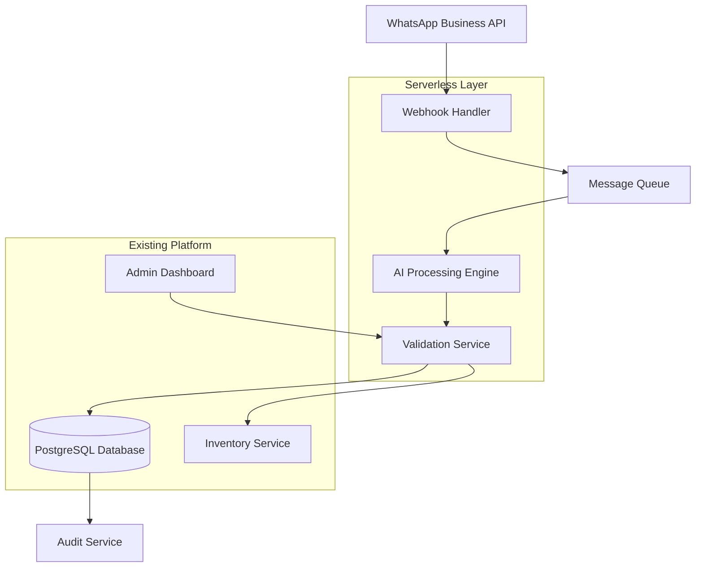

# Design Document: WhatsApp Supplier Inventory Automation System

## Overview

The WhatsApp Supplier Inventory Automation System transforms unstructured supplier communications into validated inventory updates through an event-driven serverless architecture. The system integrates with the existing NestJS/TypeORM e-commerce platform to provide seamless inventory management for West African suppliers who communicate via WhatsApp.

The solution follows a pipeline architecture: **WhatsApp → Webhook Processing → AI Extraction → Human Validation → Inventory Integration**, with comprehensive audit trails and supplier management capabilities.

## Architecture

### High-Level Architecture



### Component Architecture

The system consists of five primary components:

1. **WhatsApp Integration Layer**: Handles webhook reception and message parsing
2. **AI Processing Engine**: Extracts structured data from unstructured content
3. **Human Validation Service**: Provides admin interface for review and approval
4. **Inventory Integration Service**: Updates existing product and inventory entities
5. **Audit and Monitoring Service**: Tracks all operations and decisions

### Technology Stack

- **Serverless Functions**: AWS Lambda or Cloudflare Workers for scalable processing
- **Message Queue**: AWS SQS or Redis for reliable message handling
- **AI Services**: AWS Textract for OCR, OpenAI/Claude for text processing
- **Database**: PostgreSQL (existing) with new entities for supplier management
- **File Storage**: AWS S3 for document and image storage
- **Integration**: NestJS controllers and services for platform integration

## Components and Interfaces

### WhatsApp Webhook Handler

**Purpose**: Receives and processes incoming WhatsApp messages, images, PDFs, and voice notes.

**Key Responsibilities**:
- Webhook signature verification for security
- Message type detection and routing
- File download and storage management
- Supplier authentication and rate limiting

**Interface**:
```typescript
interface WebhookHandler {
  processIncomingMessage(payload: WhatsAppWebhookPayload): Promise<ProcessingResult>;
  downloadMedia(mediaId: string): Promise<MediaFile>;
  authenticateSupplier(phoneNumber: string): Promise<Supplier>;
  validateWebhookSignature(signature: string, payload: string): boolean;
}

interface WhatsAppWebhookPayload {
  object: string;
  entry: WebhookEntry[];
}

interface WebhookEntry {
  id: string;
  changes: WebhookChange[];
}

interface WebhookChange {
  value: {
    messaging_product: string;
    metadata: { phone_number_id: string };
    messages?: WhatsAppMessage[];
    statuses?: MessageStatus[];
  };
  field: string;
}
```

### AI Processing Engine

**Purpose**: Extracts structured product information from unstructured supplier content using OCR and natural language processing.

**Key Responsibilities**:
- OCR processing for images and PDFs
- Text extraction and normalization
- Product data structure mapping
- Confidence scoring and duplicate detection
- Learning from human corrections

**Interface**:
```typescript
interface AIProcessingEngine {
  processTextMessage(content: string, supplier: Supplier): Promise<ExtractedProduct[]>;
  processImage(imageUrl: string, supplier: Supplier): Promise<ExtractedProduct[]>;
  processPDF(pdfUrl: string, supplier: Supplier): Promise<ExtractedProduct[]>;
  processVoiceNote(audioUrl: string, supplier: Supplier): Promise<ExtractedProduct[]>;
  calculateConfidenceScore(extraction: ExtractedProduct): number;
  detectDuplicates(product: ExtractedProduct): Promise<DuplicateMatch[]>;
}

interface ExtractedProduct {
  name: string;
  brand?: string;
  category?: string;
  condition?: string;
  grade?: RefurbishedGrade;
  price?: number;
  currency?: string;
  quantity?: number;
  specifications?: Record<string, string>;
  confidenceScore: number;
  extractionMetadata: {
    sourceType: 'text' | 'image' | 'pdf' | 'voice';
    processingTime: number;
    aiModel: string;
    extractedFields: string[];
  };
}
```

### Human Validation Service

**Purpose**: Provides admin interface for reviewing, editing, and approving AI-generated product suggestions.

**Key Responsibilities**:
- Queue management for pending validations
- Side-by-side comparison of original content and extracted data
- Bulk approval and editing capabilities
- Feedback collection for AI improvement
- Integration with existing admin authentication

**Interface**:
```typescript
interface HumanValidationService {
  getPendingValidations(adminId: string): Promise<ValidationItem[]>;
  approveProduct(validationId: string, edits?: Partial<ExtractedProduct>): Promise<void>;
  rejectProduct(validationId: string, feedback: string): Promise<void>;
  bulkApprove(validationIds: string[], edits?: Record<string, Partial<ExtractedProduct>>): Promise<void>;
  provideFeedback(validationId: string, feedback: ValidationFeedback): Promise<void>;
}

interface ValidationItem {
  id: string;
  supplierId: string;
  supplierName: string;
  originalContent: {
    type: 'text' | 'image' | 'pdf' | 'voice';
    content: string;
    mediaUrl?: string;
  };
  extractedProduct: ExtractedProduct;
  suggestedActions: ValidationAction[];
  createdAt: Date;
  priority: 'low' | 'medium' | 'high';
}

interface ValidationAction {
  type: 'create' | 'update' | 'merge';
  targetProductId?: string;
  confidence: number;
  reasoning: string;
}
```

### Inventory Integration Service

**Purpose**: Updates existing Product and InventoryItem entities based on validated supplier data.

**Key Responsibilities**:
- Product creation and updates using existing entities
- Inventory quantity management
- Category and segment assignment
- Price management across countries
- Integration with existing business logic

**Interface**:
```typescript
interface InventoryIntegrationService {
  createProduct(productData: ValidatedProduct, supplierId: string): Promise<Product>;
  updateProduct(productId: string, updates: Partial<ValidatedProduct>): Promise<Product>;
  updateInventory(productId: string, quantity: number, supplierId: string): Promise<InventoryItem>;
  assignCategory(productName: string, brand: string): Promise<Category>;
  assignSegment(product: ValidatedProduct): Promise<ProductSegmentEntity>;
  createPricing(productId: string, pricing: PricingData[]): Promise<ProductPrice[]>;
}

interface ValidatedProduct extends ExtractedProduct {
  validatedBy: string;
  validatedAt: Date;
  adminEdits?: Record<string, any>;
  approvalNotes?: string;
}

interface PricingData {
  countryCode: string;
  price: number;
  currency: string;
  isActive: boolean;
}
```

### Supplier Management Service

**Purpose**: Manages supplier profiles, authentication, and performance tracking.

**Key Responsibilities**:
- Supplier registration and profile management
- WhatsApp number authentication
- Performance metrics and history tracking
- Template and guidance provision
- Access control and rate limiting

**Interface**:
```typescript
interface SupplierManagementService {
  registerSupplier(supplierData: SupplierRegistration): Promise<Supplier>;
  authenticateSupplier(phoneNumber: string): Promise<Supplier | null>;
  updateSupplierMetrics(supplierId: string, metrics: SupplierMetrics): Promise<void>;
  getSupplierHistory(supplierId: string): Promise<SupplierActivity[]>;
  provideTemplate(supplierId: string, productType: string): Promise<MessageTemplate>;
}

interface Supplier {
  id: string;
  name: string;
  phoneNumber: string;
  countryCode: string;
  isActive: boolean;
  registrationDate: Date;
  lastActivity: Date;
  performanceMetrics: SupplierMetrics;
  preferredCategories: string[];
  templates: MessageTemplate[];
}

interface SupplierMetrics {
  totalSubmissions: number;
  approvedSubmissions: number;
  averageConfidenceScore: number;
  averageProcessingTime: number;
  lastSubmissionDate: Date;
  qualityRating: number; // 1-5 scale
}
```

## Data Models

### New Database Entities

The system extends the existing database schema with new entities for supplier management and processing workflow:

```typescript
// Supplier Entity
@Entity('suppliers')
export class Supplier {
  @PrimaryGeneratedColumn('uuid')
  id: string;

  @Column({ length: 255 })
  name: string;

  @Column({ name: 'phone_number', unique: true, length: 20 })
  phoneNumber: string;

  @Column({ name: 'country_code', length: 2 })
  countryCode: string;

  @Column({ name: 'is_active', default: true })
  isActive: boolean;

  @Column({ type: 'jsonb', nullable: true })
  performanceMetrics: SupplierMetrics;

  @Column({ name: 'preferred_categories', type: 'text', array: true, default: [] })
  preferredCategories: string[];

  @CreateDateColumn({ name: 'created_at' })
  createdAt: Date;

  @UpdateDateColumn({ name: 'updated_at' })
  updatedAt: Date;

  @OneToMany(() => SupplierSubmission, submission => submission.supplier)
  submissions: SupplierSubmission[];
}

// Supplier Submission Entity
@Entity('supplier_submissions')
export class SupplierSubmission {
  @PrimaryGeneratedColumn('uuid')
  id: string;

  @ManyToOne(() => Supplier, supplier => supplier.submissions)
  @JoinColumn({ name: 'supplier_id' })
  supplier: Supplier;

  @Column({ name: 'whatsapp_message_id', unique: true })
  whatsappMessageId: string;

  @Column({ name: 'content_type' })
  contentType: 'text' | 'image' | 'pdf' | 'voice';

  @Column({ type: 'text' })
  originalContent: string;

  @Column({ name: 'media_url', nullable: true })
  mediaUrl: string;

  @Column({ name: 'processing_status' })
  processingStatus: 'pending' | 'processing' | 'completed' | 'failed';

  @Column({ type: 'jsonb', nullable: true })
  extractedData: ExtractedProduct[];

  @Column({ name: 'validation_status' })
  validationStatus: 'pending' | 'approved' | 'rejected';

  @Column({ name: 'validated_by', nullable: true })
  validatedBy: string;

  @Column({ name: 'validation_notes', type: 'text', nullable: true })
  validationNotes: string;

  @CreateDateColumn({ name: 'created_at' })
  createdAt: Date;

  @UpdateDateColumn({ name: 'updated_at' })
  updatedAt: Date;
}

// Processing Log Entity
@Entity('processing_logs')
export class ProcessingLog {
  @PrimaryGeneratedColumn('uuid')
  id: string;

  @ManyToOne(() => SupplierSubmission)
  @JoinColumn({ name: 'submission_id' })
  submission: SupplierSubmission;

  @Column({ name: 'processing_stage' })
  processingStage: 'webhook' | 'ai_extraction' | 'validation' | 'inventory_update';

  @Column({ name: 'processing_status' })
  processingStatus: 'started' | 'completed' | 'failed';

  @Column({ name: 'processing_time_ms' })
  processingTimeMs: number;

  @Column({ type: 'text', nullable: true })
  errorMessage: string;

  @Column({ type: 'jsonb', nullable: true })
  metadata: Record<string, any>;

  @CreateDateColumn({ name: 'created_at' })
  createdAt: Date;
}
```

### Integration with Existing Entities

The system leverages existing entities with minimal modifications:

- **Product**: Extended with supplier tracking via `supplierId` field in InventoryItem
- **InventoryItem**: Uses existing `supplierId` field for supplier association
- **AuditLog**: Extended with new actions for supplier operations
- **User**: Admin users validate supplier submissions using existing role system

## Error Handling

### Error Classification

**Webhook Errors**:
- Invalid signature: Reject with 401 status
- Malformed payload: Log and return 400 status
- Rate limiting: Return 429 with retry-after header

**Processing Errors**:
- AI service failures: Queue for retry with exponential backoff
- File download failures: Retry up to 3 times, then mark as failed
- Database errors: Rollback transactions and notify administrators

**Validation Errors**:
- Timeout on human validation: Send reminder notifications
- Conflicting approvals: Use timestamp-based resolution
- Invalid edits: Validate against schema before saving

### Recovery Mechanisms

**Message Queue Resilience**:
- Dead letter queues for failed messages
- Automatic retry with exponential backoff
- Manual reprocessing capabilities for administrators

**Data Consistency**:
- Database transactions for multi-table operations
- Idempotent operations to handle duplicate processing
- Audit trails for all state changes

**Service Availability**:
- Circuit breaker pattern for external service calls
- Graceful degradation when AI services are unavailable
- Health checks and monitoring for all components

## Testing Strategy

The system requires comprehensive testing across multiple layers to ensure reliability and accuracy in production environments.

### Unit Testing Approach

**Component Testing**:
- Mock external services (WhatsApp API, AI services) for isolated testing
- Test error handling and edge cases for each service method
- Validate data transformation and mapping logic
- Test supplier authentication and rate limiting

**Database Testing**:
- Test entity relationships and constraints
- Validate migration scripts and schema changes
- Test transaction rollback scenarios
- Verify audit log creation for all operations

### Property-Based Testing Strategy

Property-based testing validates universal correctness properties across the system using randomized inputs. Each test runs a minimum of 100 iterations to ensure comprehensive coverage.

**Configuration**: 
- Testing framework: Jest with fast-check for TypeScript
- Minimum iterations: 100 per property test
- Each test tagged with: **Feature: whatsapp-supplier-automation, Property {number}: {property_text}**

**Test Data Generation**:
- Random supplier data with valid phone numbers and country codes
- Generated WhatsApp message payloads with various content types
- Synthetic product data with different categories and specifications
- Simulated AI extraction results with varying confidence scores

## Correctness Properties

*A property is a characteristic or behavior that should hold true across all valid executions of a system—essentially, a formal statement about what the system should do. Properties serve as the bridge between human-readable specifications and machine-verifiable correctness guarantees.*

Based on the prework analysis and property reflection, the following properties validate the system's correctness across all inputs and scenarios:

### Property 1: Message Processing Completeness
*For any* WhatsApp message (text, image, PDF, or voice), the webhook handler should successfully receive, authenticate the supplier, and queue the message for processing within the specified time limits.
**Validates: Requirements 1.1, 1.2, 1.3, 1.4, 5.3**

### Property 2: Message Grouping Consistency  
*For any* sequence of messages from the same supplier within a time window, the system should group them together for batch processing while maintaining chronological order.
**Validates: Requirements 1.5**

### Property 3: AI Extraction Field Coverage
*For any* processed content (text, image, PDF, voice), the AI parser should attempt extraction of all required product fields (name, brand, category, condition, grade, price, quantity, specifications) and assign valid confidence scores (0-100) to each field.
**Validates: Requirements 2.1, 2.2, 2.3, 2.4, 2.5**

### Property 4: Duplicate Detection Accuracy
*For any* extracted product that matches existing products in the system, the AI parser should flag it as a duplicate and suggest appropriate merge or update actions.
**Validates: Requirements 2.6**

### Property 5: Validation Workflow Completeness
*For any* completed AI extraction, the human validation service should provide all necessary information (original content, extracted data, confidence scores) and support all validation actions (approve, reject, edit).
**Validates: Requirements 3.1, 3.2, 3.3, 3.4, 3.5**

### Property 6: Inventory Integration Consistency
*For any* approved product validation, the inventory system should create or update the appropriate entities (Product, InventoryItem, ProductPrice) with correct categorization and grading based on the extracted data.
**Validates: Requirements 4.1, 4.2, 4.3, 4.4, 4.5**

### Property 7: Supplier Management Authentication
*For any* supplier interaction with the system, authentication should be enforced, performance metrics should be tracked, and access privileges should be managed based on historical performance.
**Validates: Requirements 5.1, 5.2, 5.4, 5.5**

### Property 8: Comprehensive Audit Logging
*For any* system operation (message receipt, AI processing, human validation, inventory update, error occurrence), the audit trail should capture all required information including timestamps, actors, actions, and state changes.
**Validates: Requirements 6.1, 6.2, 6.3, 6.4, 6.5**

### Property 9: Error Recovery and Retry Logic
*For any* system failure (webhook delivery, AI processing, database operations, external service unavailability, critical errors), the error handler should implement appropriate recovery mechanisms including retries, rollbacks, queuing, and escalation.
**Validates: Requirements 7.4, 7.5, 10.1, 10.2, 10.3, 10.4, 10.5**

### Property 10: Security Processing Universality
*For any* incoming content (text, images, PDFs), the security handler should perform comprehensive security validation including malware scanning, content sanitization, encryption of sensitive data, and secure transmission protocols.
**Validates: Requirements 8.1, 8.2, 8.3, 8.4, 8.5**

### Property 11: Template Management Lifecycle
*For any* supplier template interaction (request, usage, update, analysis), the template manager should provide appropriate templates, validate submissions, notify of changes, and suggest improvements based on usage patterns.
**Validates: Requirements 9.1, 9.2, 9.3, 9.4, 9.5**

### Property 12: Supplier Data Round-Trip Consistency
*For any* valid supplier submission that goes through the complete pipeline (WhatsApp → AI → Validation → Inventory), the final inventory state should accurately reflect the approved supplier data with proper audit trails.
**Validates: Requirements 1.1, 2.1, 3.5, 4.1, 6.4**

## Testing Strategy

### Dual Testing Approach

The system requires both unit testing and property-based testing for comprehensive coverage:

**Unit Tests**: Focus on specific examples, edge cases, and integration points
- Webhook signature validation with known test cases
- AI extraction accuracy with sample documents
- Database transaction rollback scenarios
- Admin interface functionality with mock data
- Error handling with specific failure conditions

**Property Tests**: Verify universal properties across all inputs
- Message processing with randomized WhatsApp payloads
- AI extraction with generated product descriptions
- Validation workflows with synthetic approval scenarios
- Inventory updates with random product data
- Security scanning with various content types

### Property-Based Testing Configuration

**Framework**: Jest with fast-check for TypeScript property-based testing
**Minimum Iterations**: 100 per property test to ensure comprehensive input coverage
**Test Tagging**: Each property test tagged with: **Feature: whatsapp-supplier-automation, Property {number}: {property_text}**

**Test Data Generators**:
- WhatsApp webhook payloads with various message types
- Supplier profiles with different performance metrics
- Product data across all categories and segments
- AI extraction results with varying confidence scores
- Admin validation decisions and edits

**Property Test Examples**:
```typescript
// Property 1: Message Processing Completeness
test('Feature: whatsapp-supplier-automation, Property 1: Message processing completeness', () => {
  fc.assert(fc.property(
    fc.record({
      messageType: fc.constantFrom('text', 'image', 'pdf', 'voice'),
      supplier: supplierGenerator(),
      content: fc.string(),
      timestamp: fc.date()
    }),
    async (messageData) => {
      const result = await webhookHandler.processIncomingMessage(messageData);
      expect(result.processed).toBe(true);
      expect(result.processingTime).toBeLessThan(30000);
      expect(result.supplierAuthenticated).toBe(true);
    }
  ), { numRuns: 100 });
});

// Property 12: Supplier Data Round-Trip Consistency  
test('Feature: whatsapp-supplier-automation, Property 12: Supplier data round-trip consistency', () => {
  fc.assert(fc.property(
    supplierSubmissionGenerator(),
    async (submission) => {
      const extracted = await aiParser.processSubmission(submission);
      const validated = await humanValidator.approve(extracted.id, {});
      const inventory = await inventoryService.updateFromValidation(validated);
      
      // Verify data consistency through the pipeline
      expect(inventory.product.name).toBe(validated.productData.name);
      expect(inventory.quantity).toBe(validated.productData.quantity);
      
      // Verify audit trail exists
      const auditLogs = await auditService.getLogsForSubmission(submission.id);
      expect(auditLogs.length).toBeGreaterThan(0);
    }
  ), { numRuns: 100 });
});
```

### Integration Testing Strategy

**End-to-End Workflow Testing**:
- Complete supplier submission pipeline from WhatsApp to inventory
- Admin dashboard functionality with real database interactions
- Error recovery scenarios with simulated service failures
- Performance testing with concurrent supplier submissions

**External Service Integration**:
- WhatsApp Business API webhook handling
- AWS Textract OCR processing
- OpenAI/Claude text extraction
- Database transaction management

**Security Testing**:
- Webhook signature validation
- Content sanitization effectiveness
- Access control enforcement
- Data encryption verification

The testing strategy ensures both individual component correctness and system-wide behavior validation, providing confidence in the system's reliability and accuracy for production deployment.